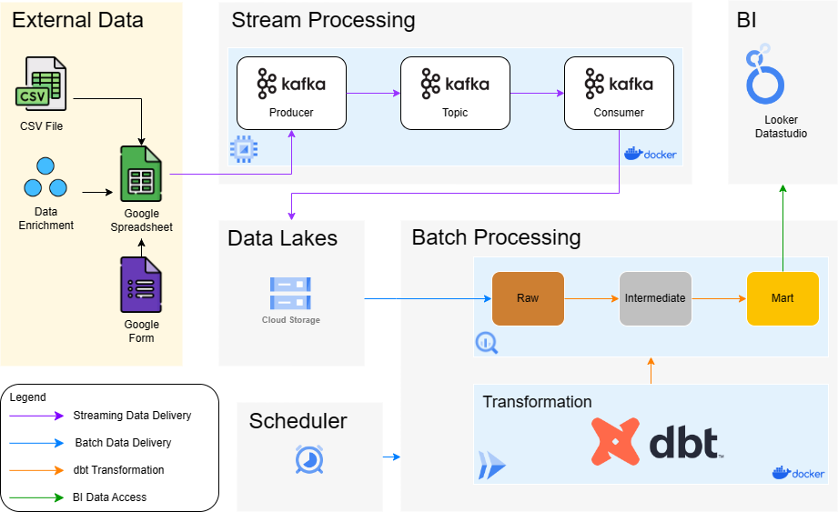
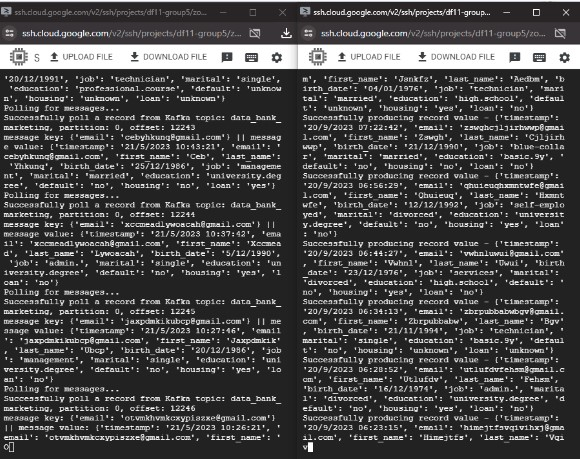
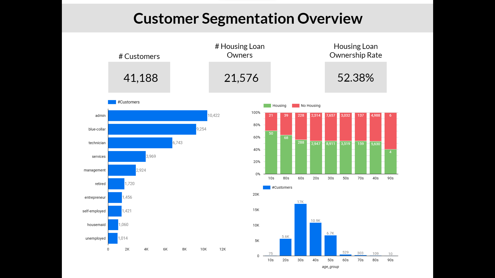
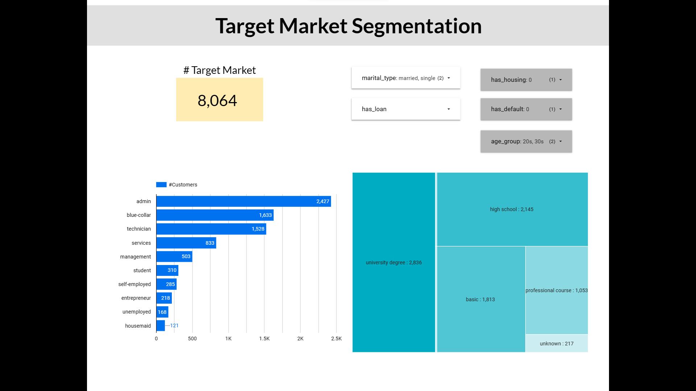

# Documentation

## Problem Statement
The marketing team of a bank company wants to launch a more effective marketing campaign program for housing loan product. To do this, they need to understand the different types of customers they have and how to target them. They request the data team to create customer segmentation based on their demographic characteristics, such as age, education, occupation, etc.

The marketing team need data source about customer segmentation in order to decide their marketing strategy. This reference must be reliable and future-proof for upcoming marketing campaign.

To initiate this project, the data team receives a dump file of customer profile data in csv format from the marketing team. The data team will create end to end data pipeline to provide reliable data source, insights and recommendations to the marketing team. The dev team will also create an API to feed the customer profile data to the marketing campaign program, so that the marketing team can send personalized messages and offers to each segment.

## Objective
1. Data pipeline that shows demographic customer segmentation from registration data
1. Analytical dashboard that shows customer segmentation and target market for housing loan product campaign

## Architecture

## Data Preparation
We treat the dump file as opening account bank process by integrate it with application form. By this approach, the raw file got copied to google spreadsheet first. Then We doing data enrichment by adding timestamp on spreadsheet. As we speak, the spreadhseet was integrated with google form as an application form for bank account opening. 

## Streaming
### Prerequisite:

A. Python 3: [Install Here](https://www.python.org/downloads/)
    
B. Docker and Docker Compose: [Install Here](https://docs.docker.com/engine/install/ubuntu/)
    
C. Google's Credential Service Account used for GCS and Bigquery access: [Get Here](https://developers.google.com/workspace/guides/create-credentials)
    
D. Kafka Python Libraries, Install using `pip` package manager.
    
Rename the google credentials into `google_credentials.json` and store it in your `$HOME` directory

### Project Guide:

A. Clone this project
            
    git clone https://github.com/rifqiabidin/df11-project-group5.git
        
B. Open this project in terminal and navigate to the directory of streaming folder	
        
    # change directory
    cd src/streaming
        
C. Install the required Kafka library, on terminal run following command

    pip install -r requirements.txt

D. Set up a local Kafka cluster by creating images and containers using `docker-compose`

    docker compose up
	
E. Start the data streaming by generating the messages using Kafka Producer

	python producer.py

The outputs will be messages sent to the topic on the Kafka cluster

F. While the Kafka Producer is running, open up new terminal and start the Kafka Consumer to read out the data from kafka topic

	python consumer.py
		
Messages generated by the produced will start showing up in the consumer window
    

## Batch

## Transformation
We implement medallion architecture using dbt. 
1. Bronze Layer
Consist of raw state of the data source and select only the required column 
2. Silver Layer
Consist of cleaned and normalized data. In this layer we did feature encoding, standardization values, delete unneeded characters, and change the date into suitable format. Then we divide columsn into their own separate dimensions and fact table. To optimize it, we partition and cluster the table.
   
4. Gold Layer
Consist of refined data and presented in a format suitable for reporting
## Visualization

# Source
- [Code](/src)
- [Presentation](https://docs.google.com/presentation/d/1_grq5J4qOXGRR3SS7LwWzY4tLQM4eoFDs-DKsgmkfCg/edit?usp=sharing)
- [Dashboard](https://lookerstudio.google.com/reporting/d643c225-ab7b-4c13-a3fa-04e0f3ae1a9c)
